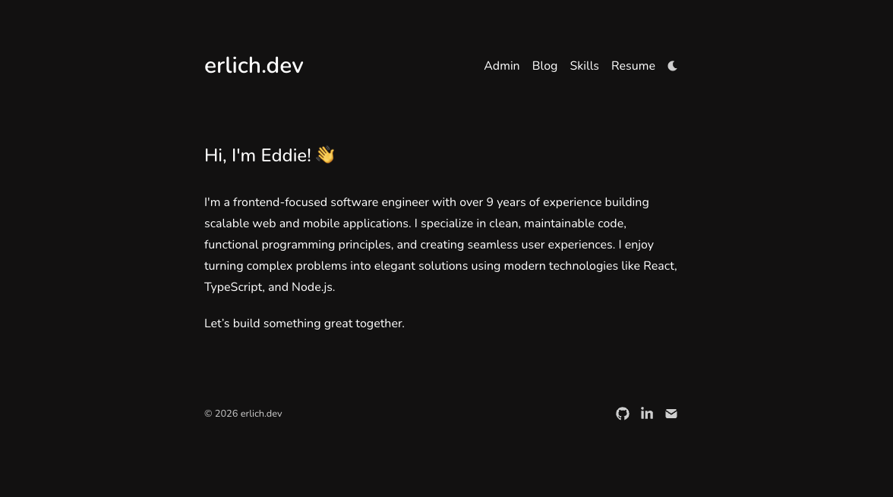

# erlich.dev — Eddie Erlich's Portfolio

[](https://www.erlich.dev)
[](https://github.com/eddierl)
[](https://www.linkedin.com/in/eddie-erlich/)

> Frontend-focused software engineer with 10 years of experience, currently looking for my next role.



## About

This is my personal portfolio and blog, built with modern web technologies and hosted on Vercel. It showcases my work, skills, and writing — and serves as a living resume for anyone interested in working with me.

**I'm actively looking for frontend / full-stack engineering roles.** If you'd like to chat, reach out via [email](mailto:eddie@erlich.dev) or [LinkedIn](https://www.linkedin.com/in/eddie-erlich/).

## Tech Stack

- **Framework:** [Next.js 16](https://nextjs.org/) (App Router, Turbopack)
- **Language:** TypeScript
- **Styling:** [Tailwind CSS 4](https://tailwindcss.com/)
- **Deployment:** [Vercel](https://vercel.com/)
- **Analytics:** Vercel Web Analytics + Speed Insights
- **Testing:** Playwright, Jest, Cypress

## Features

- **Blog** — MDX-powered posts with rich content, code blocks, and interactive embeds
- **Skills** — Categorized display of languages, frameworks, cloud, and tools
- **Admin Dashboard** — Real-time visitor analytics (user agents, geolocation, referrals)
- **Dynamic OG Images** — Auto-generated Open Graph images for social sharing
- **SEO** — Sitemap, robots.txt, JSON-LD schema, RSS/Atom/JSON feeds
- **Dark / Light Mode** — Dark theme default with light mode support via `next-themes`

## Getting Started

```bash
pnpm install
pnpm dev
```

Open [http://localhost:3000](http://localhost:3000).

## License

MIT
